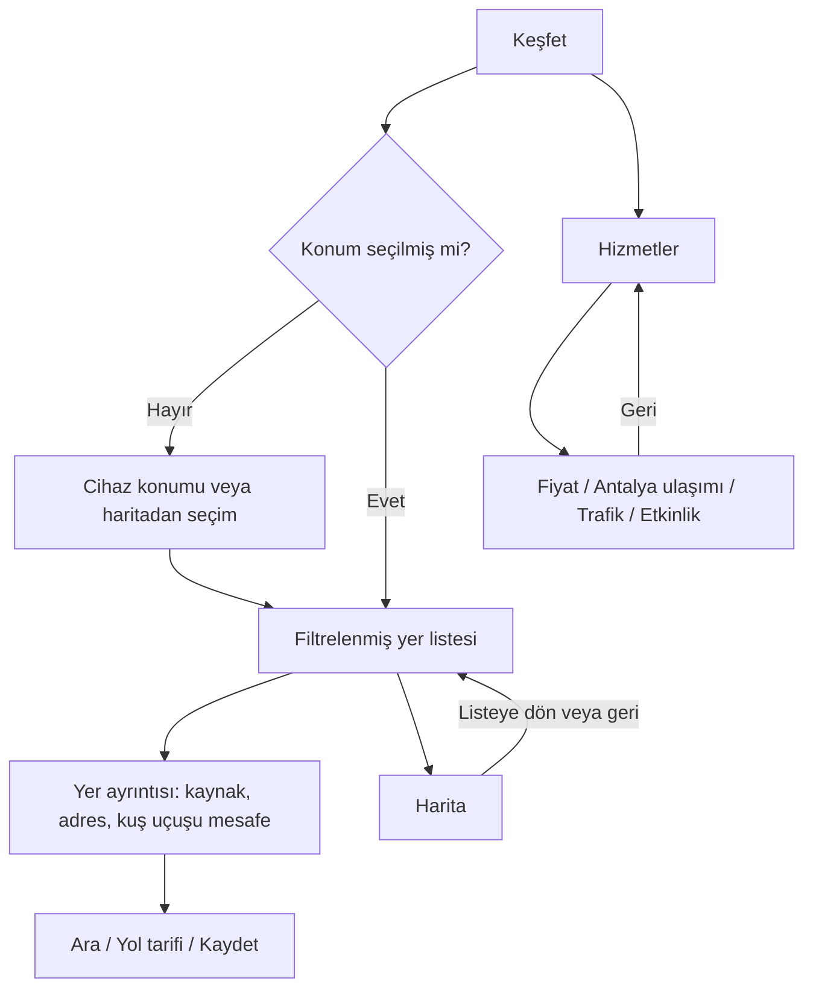

# Mobil kullanım düzeltmesi — 10 Ekim 2026

## Bulgular ve kararlar

Canlı `6d0c501` sürümünde mobil Keşfet doğrudan harita ile açılıyordu. Liste 85 px kapalı paneldeydi. Konum seçilmeden Antalya merkezindeki kayıtlar “çevredeki yerler” olarak gösterilebiliyordu. Haritada görünür kayıt yoksa liste tüm yüklenmiş kayıtlara dönüyordu; sayaç 60 ile, gösterilen satırlar 36 ile sınırlanıyordu. Alt sayfalar tarayıcı geri tuşunu tutarlı karşılamıyordu. Yer ayrıntıları alt menüyle aynı belge katmanındaydı.

Düzeltme yeni kaynak veya yeni işlev eklemez. Açılış okunabilir bir listedir. Konumsuz açılışta açık seçim kartı bulunur; rastgele bir şehir yakındaymış gibi sorgulanmaz. Harita açık bir düğmeyle açılır ve listeye dönülür. Harita paneli yalnızca görünür alandaki kayıtları sayar ve aynı kayıtları gösterir. Yer ayrıntısı yerel `dialog` katmanında açılır; odağı tutar, arka planı kilitler ve geri tuşuyla kapanır.

## Düğme ve ekran sözleşmesi

| Düğme | Açılacak ekran / davranış | Veri kuralı |
| --- | --- | --- |
| Keşfet | Konum seçimi veya yakın yerlerin kaydırılabilir listesi | Konum seçilmeden yakındaki yer sorgusu çalışmaz |
| Konum / Konumumu kullan | Cihaz konumunu alır, başarısızlık açıklanır | Eski konum kullanılıyorsa açıkça belirtilir |
| Haritadan seç | Dokunarak nokta seçimi; sonra listeye dönüş | Seçim cihaz konumu olarak adlandırılmaz |
| Kategori | Yalnızca seçilen yer türünü gösterir | Kayıt yokluğu, yer olmadığı iddiasına dönüştürülmez |
| Kategoriler | Tam kategori seçme penceresi | Gizli yatay seçenekler için açık alternatif |
| Eczane → Nöbetçi | Kaynakta alınan günlük nöbet kayıtları | Alternatif kaynak ve sorgu tarihi belirtilir |
| Harita | Aynı filtreyle harita | Görünür alan dışındaki sonuçlar görünürmüş gibi sayılmaz |
| Listeye dön / tarayıcı geri | Haritadan listeye | Kullanıcı uygulamadan çıkmaya zorlanmaz |
| Yer satırı | Adres, kaynak, mesafe, telefon ve yol tarifi | Mesafe kuş uçuşudur; açık olma durumu varsayılmaz |
| Kaydet | Cihazdaki kayıt listesine ekler / kaldırır | Kaydedilen bilgi canlı veri olarak sunulmaz |
| Hizmetler | Fiyat, toplu ulaşım, trafik, etkinlik ekranları | Her ekran kendi aramasını ve kapsamını taşır |
| Market fiyatları | İl, ürün kategorisi ve kaynak şube fiyatları | Stok ve güncel raf fiyatı garantisi değildir |
| Toplu ulaşım | Antalya durak listesi, isteğe bağlı harita ve araç tahminleri | Konum dışarıdaysa Antalya merkez varsayımı açıkça belirtilir; sahte kullanıcı mesafesi gösterilmez |
| Trafik | Kaynak varsa trafik; yoksa normal yol haritası | Normal harita canlı trafik olarak adlandırılmaz |
| Etkinlikler | Şehir seçkisi ve kaynak bağlantıları | Doğrulanmamış tarih etkinlik saati olarak sunulmaz |
| Hizmetler / Diğer geri düğmesi | İlgili dizine döner | Aramalar başka ekranlara taşınmaz |
| Kaydedilen | Cihazdaki kayıtlar ve kaldırma | Kaydetme zamanına ait bilgi olduğu açıklanır |
| Diğer | Mevcut haber, radyo ve oyunlar | Çalan radyo korunur; oyun mevcut tam ekran akışını kullanır |

## Doğruluk sınırları

Kamuya açık harita kayıtları gerçek zamanlı işletme doğrulaması değildir. Kaynaklar tüm yerleri veya tüm şehirleri kapsamayabilir. Başarısız istekler boş sonuçtan ayrılır. Eski veya geçersiz zamanlı otopark ölçümü güncel bilgi olarak gösterilmez. Trafik için TomTom anahtarı gerekir; bu çalışmada yeni anahtar kurulmamıştır. Fiziksel telefon doğrulaması yapılmadıkça tarayıcı emülasyonu gerçek cihaz testi diye adlandırılmaz.

## Doğrulama

`tests/e2e/mobile-foundation.spec.ts`: konumsuz açılış, son kayda erişme, ayrıntı katmanı, kaydetme, manuel seçim, harita/geri, servis araması ayrımı, Antalya kapsamı ve veri hatası. Mevcut kaynak/parser denetimleri `npm test` kapsamındadır. Son tarayıcı sonuçları değişikliğin PR açıklamasına eklenir.

Yayın öncesinde 20 farklı senaryo 360×800 ve 412×915 Chromium emülasyonlarında doğrulandı. Harita/navigasyonun son koşusu 20/20 geçti; aynı çalışmadaki mevcut kabuk, masaüstü, trafik ve yeniden tasarım kontrollerinin 18/18 sonucu da korundu. İki boyutta kaynaklardan yalnızca birinin başarısız olduğu boş sonuç durumu da geçti. Ek olarak mevcut GPS, radyo ve oyun akışlarının 7/7 denetimi geçti. `npm test` kaynak denetimleri, zaman doğruluğu testleri, TypeScript ve üretim derlemesini geçti. Safari/WebKit indirildi fakat ortamda gerekli sistem kütüphaneleri yoktu; yönetici erişimi de olmadığından çalıştırılamadı. Gerçek iPhone/Android cihaz testi yapılmadı.
